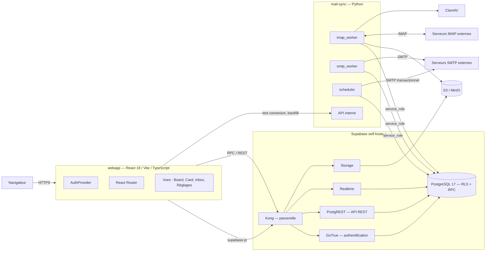
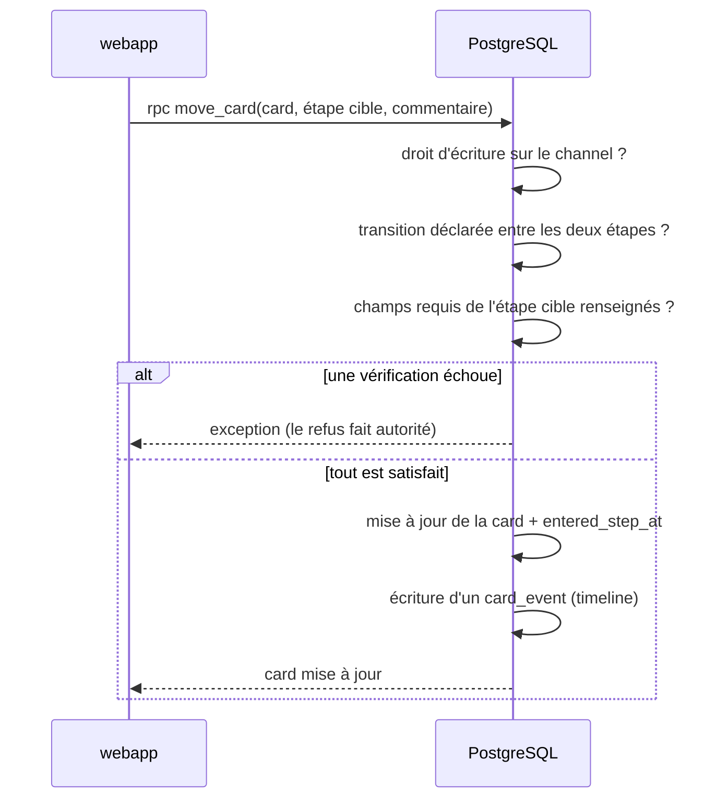
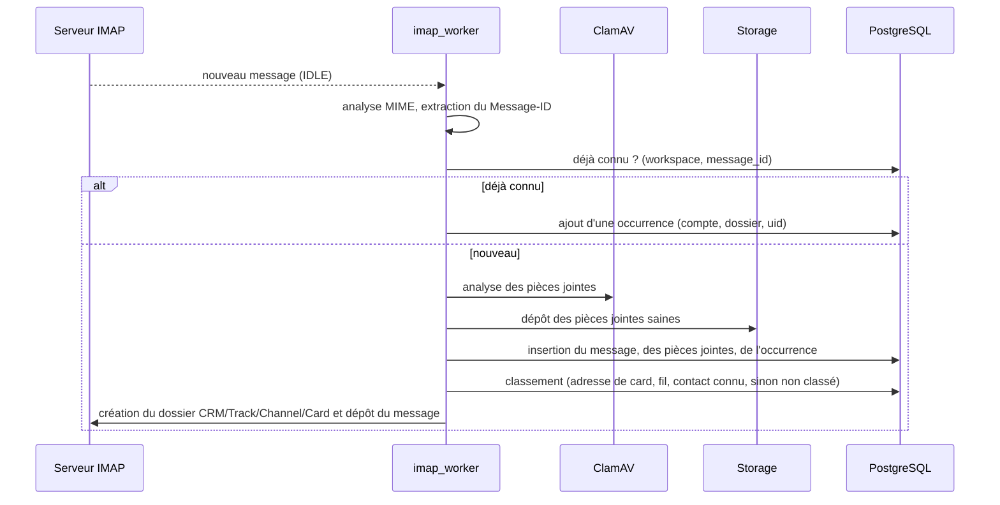

# Dossier d'architecture technique — P2Enjoy CRM

Document de référence de l'architecture. Toute évolution du schéma, des services déployés, des
fonctions backend ou des variables d'environnement met ce fichier à jour **dans le même
changement** que le code.

- Unité de backlog de référence : `CRM-000` (socle documentaire) — voir `docs/MASTER_PLAN.md`.
- Documents liés : `docs/SCHEMA.md`, `docs/SPEC-permissions-rls.md`,
  `docs/SPEC-workflow-engine.md`, `docs/SPEC-form-composer.md`, `docs/SPEC-mail-subsystem.md`,
  `docs/PROD_MIGRATIONS.md`.

---

## 1. Contexte et objectifs

P2Enjoy CRM est un outil interne de suivi de projets commerciaux. Il doit permettre à une
petite équipe (administrateurs et business developers) d'organiser librement son suivi en
**Tracks** et **Channels**, de faire avancer des **Cards** dans des workflows différents selon
le canal, et de conserver dans chaque card la correspondance email associée.

Contraintes structurantes :

- **Auto-hébergement.** Supabase self-hosted, pile entièrement dockerisée, aucun service cloud
  obligatoire en développement.
- **Règles métier côté base.** Les autorisations et les gardes de workflow sont appliquées en
  PostgreSQL, jamais uniquement dans l'interface.
- **Messagerie réelle.** Le développement utilise un vrai serveur IMAP/SMTP, pas une simulation.
- **Flexibilité de l'organisation.** L'arborescence Track/Channel et les workflows sont des
  données, pas du code.

## 2. Vue d'ensemble

## 3. Composants

### 3.1 `webapp` — interface

React 18 + Vite + TypeScript + Tailwind. Responsabilités :

- Authentification via `supabase-js` (GoTrue), session persistée par la bibliothèque.
- Lecture des données par PostgREST, **écritures métier par RPC** lorsqu'une règle doit être
  appliquée (transition de card, copie de workflow, envoi d'email).
- Abonnements Realtime pour les commentaires, les déplacements de cards et les notifications.
- Aucune règle d'autorisation propre : l'interface masque ce que le backend refuserait, mais le
  refus fait toujours autorité.

Découpage prévu : `src/lib` (client Supabase, types générés, helpers), `src/features/<domaine>`
(board, card, inbox, workflow, réglages), `src/components/ui` (composants du design system),
`src/routes`.

### 3.2 `db` — PostgreSQL 17

Source de vérité du produit. Contient :

- le schéma applicatif (voir `docs/SCHEMA.md`) ;
- les politiques **RLS** de chaque table ;
- les fonctions `SECURITY DEFINER` d'autorisation (`app.is_workspace_admin`,
  `app.can_read_channel`, `app.can_write_channel`, …) ;
- les RPC métier (`move_card`, `copy_workflow_to_track`, `queue_outbound_email`, …) ;
- les triggers d'audit et de timeline (`card_events`).

Les migrations sont appliquées au démarrage par le conteneur `migrations-runner`, qui rejoue en
ordre lexicographique les fichiers de `supabase/migrations/`, une transaction par fichier, en
s'arrêtant à la première erreur. Il démarre après GoTrue, dont le schéma `auth` est référencé dès
les migrations d'amorçage, et `rest` attend qu'il se soit terminé avec succès.

En production, ce chemin est **désactivé** par `APPLY_MIGRATIONS=false` : les migrations y sont
appliquées sur instruction humaine explicite, selon `docs/PROD_MIGRATIONS.md`. Le conteneur se
contente alors de renvoyer vers ce document et se termine avec le code `0`.

### 3.3 `mail-sync` — service Python

Seul composant autorisé à parler IMAP et SMTP. Quatre responsabilités :

| Sous-composant | Rôle |
|---|---|
| `imap_worker` | Une connexion IDLE par compte entrant ; récupération, analyse, dédoublonnage, dépôt des pièces jointes, classement, création des dossiers imbriqués |
| `smtp_worker` | Consommation de la file `mail_outbox` : envoi via l'identité SMTP de l'utilisateur, retry avec backoff, respect des quotas, archivage du message envoyé |
| `scheduler` | Ordonnanceur unique : relances de cards figées, séquences, digest quotidien, purge RGPD, recalcul du score de santé |
| API interne | Test de connexion IMAP/SMTP, déclenchement d'un backfill, exposition de l'état de synchronisation, et endpoints réservés aux tests en environnement de développement |

Il se connecte à PostgreSQL avec le rôle `service_role`. C'est **le seul** consommateur des
secrets de messagerie déchiffrés.

**Choix : un ordonnanceur applicatif plutôt que `pg_cron`.** Le service tourne déjà en continu ;
y placer l'ordonnancement évite une dépendance à une extension dont la disponibilité dans
l'image PostgreSQL retenue n'est pas encore vérifiée, et rend les tâches planifiées testables
par pytest sans manipuler la base. Compromis : si le service est arrêté, les tâches planifiées
ne s'exécutent pas — l'état de santé du service doit donc être supervisé.

### 3.4 `clamav`

Analyse chaque pièce jointe entrante avant sa mise à disposition. Une pièce jointe reste en
statut `pending` tant qu'elle n'est pas analysée et n'est jamais téléchargeable en statut
`infected`.

### 3.5 Passerelle et périphérie

- **Kong** expose l'API Supabase (REST, Auth, Storage, Realtime) sur un port unique.
- **Caddy** (production uniquement) termine TLS et sert la webapp buildée.

### 3.6 Composants de développement uniquement

| Composant | Rôle | Pourquoi il n'est pas en production |
|---|---|---|
| Supabase Studio | Inspection de la base | Outil d'administration, non exposé publiquement |
| `postgres-meta` | Introspection du schéma, consommée **uniquement** par Studio | Sans Studio, il n'a aucun consommateur |
| Inbucket | Puits des emails transactionnels | La production envoie réellement |
| Stalwart | Vrai serveur IMAP/SMTP local | La production utilise les serveurs des utilisateurs |
| Roundcube | Webmail de vérification visuelle | Outil de contrôle du développement |
| MinIO | S3 local | La production utilise son propre stockage objet |

Ces composants vivent exclusivement dans `docker-compose.dev.yml`. La passerelle **ne connaît
aucun d'entre eux** : Studio est joint directement sur son port, et il joint `postgres-meta` par
le réseau interne. La configuration de Kong est donc rigoureusement identique dans les deux
environnements, ce qui supprime toute divergence possible entre eux
(`docs/JOURNAL.md`, décision 11).

### 3.7 Versions épinglées

Aucune image n'est suivie par un tag mouvant. Toute évolution est un changement explicite qui
impose de rejouer `scripts/verify-stack.sh` et de mettre à jour `docs/PROD_MIGRATIONS.md` §4.

| Service | Image | Environnements |
|---|---|---|
| `db` | `supabase/postgres:17.6.1.136` | dev, prod |
| `migrations-runner` | `postgres:17-alpine` | dev, prod |
| `auth` | `supabase/gotrue:v2.189.0` | dev, prod |
| `rest` | `postgrest/postgrest:v14.12` | dev, prod |
| `realtime` | `supabase/realtime:v2.102.3` | dev, prod |
| `storage` | `supabase/storage-api:v1.60.4` | dev, prod |
| `supavisor` | `supabase/supavisor:2.9.5` | dev, prod |
| `kong` | `kong/kong:3.9.1` | dev, prod |
| `studio` | `supabase/studio:2026.07.07-sha-a6a04f2` | dev |
| `meta` | `supabase/postgres-meta:v0.96.6` | dev |
| `minio` | `minio/minio:RELEASE.2025-04-22T22-12-26Z` | dev |
| `minio-createbucket` | `minio/mc:RELEASE.2025-04-16T18-13-26Z` | dev |
| `inbucket` | `inbucket/inbucket:stable` | dev |
| `caddy` | `caddy:2.9-alpine` | prod |

Trois services de la distribution officielle sont **écartés** : `analytics` et `vector`
(journalisation Logflare), `imgproxy` (transformation d'images, `ENABLE_IMAGE_TRANSFORMATION` à
`false`) et `functions` (edge-runtime). Motifs détaillés dans `docs/JOURNAL.md`, décision 12.

### 3.8 Contraintes d'exécution de l'hôte

Realtime et Supavisor élèvent leur nombre de descripteurs de fichiers au démarrage. Le besoin est
exprimé par `STACK_RLIMIT_NOFILE` (défaut `100000`) plutôt que laissé à un défaut de démon : un
hôte dont la limite dure est inférieure doit l'abaisser, faute de quoi ces deux services
redémarrent en boucle (`docs/JOURNAL.md`, décision 14).

## 4. Flux principaux

### 4.1 Authentification et session

1. L'utilisateur s'authentifie par email et mot de passe auprès de GoTrue.
2. GoTrue émet un JWT contenant `sub` (l'identifiant utilisateur).
3. `supabase-js` joint ce JWT à chaque requête ; PostgREST le transmet à PostgreSQL, qui
   positionne `auth.uid()`.
4. Les politiques RLS résolvent les droits **à partir des tables d'appartenance**, pas de
   revendications portées par le jeton : un droit révoqué prend effet immédiatement, sans
   attendre l'expiration du JWT.

L'inscription libre est désactivée. Les comptes sont créés par invitation d'un administrateur.

### 4.2 Déplacement d'une card dans son workflow

Le glisser-déposer du board appelle exactement la même RPC : aucun chemin d'écriture ne
contourne les gardes.

### 4.3 Réception d'un email

Le dédoublonnage par `Message-ID` est indispensable : un même message peut arriver à la fois
dans la boîte système et dans la boîte personnelle mirroir d'un utilisateur.

### 4.4 Envoi d'un email

L'interface n'envoie jamais directement. Elle appelle `queue_outbound_email(...)`, qui insère
une ligne dans `mail_outbox`. `smtp_worker` la consomme, envoie via l'identité SMTP choisie
(`From` = adresse interne de l'utilisateur, `Reply-To` = adresse de la card), puis archive le
message envoyé. Une panne SMTP ne perd donc aucun message : elle repousse la tentative.

## 5. Modèle de données

Le modèle complet, colonne par colonne, est décrit dans **`docs/SCHEMA.md`**. Familles :

| Famille | Contenu |
|---|---|
| Identité et tenancy | `profiles`, `workspaces`, `workspace_members`, `track_members`, `channel_members` |
| Organisation | `tracks`, `channels` |
| Workflows | `workflow_nodes_catalog`, `workflows`, `workflow_steps`, `workflow_transitions` |
| Formulaires | `form_fields`, `form_field_rules`, `card_field_values` |
| Cards | `cards`, `card_comments`, `card_activities`, `card_events`, `card_tags`, `card_watchers`, `card_checklists`, `card_templates` |
| Relations | `organizations`, `contacts`, `card_contacts` |
| Messagerie | `mail_inbound_accounts`, `mail_outbound_identities`, `mail_messages`, `mail_message_occurrences`, `mail_attachments`, `mail_outbox`, `mail_folder_map`, `mail_templates`, `mail_sequences`, `card_sequence_enrollments` |
| Transverse | `notifications`, `notification_preferences`, `audit_log`, `api_tokens`, `webhook_endpoints`, `webhook_deliveries`, `saved_views` |

## 6. Interfaces

| Interface | Consommateur | Nature |
|---|---|---|
| PostgREST | webapp | REST généré depuis le schéma, filtré par RLS |
| RPC PostgreSQL | webapp | Écritures métier soumises à garde |
| Realtime | webapp | Abonnements aux commentaires, cards, notifications |
| Storage | webapp, mail-sync | Pièces jointes et documents |
| API interne mail-sync | webapp (via Kong) | Test de connexion, backfill, état de synchronisation |
| Webhooks sortants | Systèmes tiers | Événements signés (unité de backlog dédiée) |
| API publique par jeton | Systèmes tiers | Lecture/écriture à portée limitée (unité de backlog dédiée) |

## 7. Authentification et autorisation

- **Authentification** : GoTrue, email et mot de passe, inscription libre désactivée,
  invitations émises par un administrateur.
- **Rôles de workspace** : `admin`, `business_developer`, `viewer`.
- **Droits fins** : `track_members` et `channel_members` accordent l'accès à un sous-arbre.
- **Application** : politiques RLS sur toutes les tables, appuyées sur des fonctions
  `SECURITY DEFINER` afin d'éviter la récursion des politiques.
- **Secrets de messagerie** : la colonne portant la référence du secret est révoquée pour le
  rôle `authenticated`. Aucun chemin de lecture ne l'expose à un client.

Le détail, y compris la matrice des droits et les preuves de refus exigées, est dans
`docs/SPEC-permissions-rls.md`.

## 8. Chiffrement des secrets

Les mots de passe IMAP/SMTP sont chiffrés via **Supabase Vault** : l'application ne stocke
qu'un identifiant de secret, et seul `mail-sync` (rôle `service_role`) peut le déchiffrer.

**Vérification préalable requise :** la disponibilité de l'extension `supabase_vault` dans
l'image PostgreSQL retenue n'est pas encore constatée. Repli documenté si elle est absente :
chiffrement `pgcrypto` avec une clé dédiée fournie par l'environnement, jamais versionnée, et
fonctions d'accès réservées à `service_role`. Le point est tranché avant toute écriture de code
de messagerie.

## 9. Déploiement

| Environnement | Assemblage | Particularités |
|---|---|---|
| Développement | `docker-compose.yml` + `docker-compose.dev.yml` | Studio, Inbucket, Stalwart, Roundcube, MinIO, Vite en HMR, seed complet |
| Production | `docker-compose.yml` + `docker-compose.prod.yml` | Caddy et TLS, images buildées, aucun outillage de développement, aucun seed |

En production, **seul Caddy publie des ports** (`80` et `443`) : Kong, PostgreSQL et le pooler ne
sont atteints que par le réseau interne de la pile. En développement, tous les ports sont publiés
sur `DEV_BIND_ADDRESS` (`127.0.0.1` par défaut).

Le stockage vise **S3 dans les deux environnements** — MinIO en développement, fournisseur réel en
production. Le repli sur système de fichiers n'est pas utilisé, afin que les deux environnements
empruntent le même chemin de code (`docs/JOURNAL.md`, décision 13).

Les migrations de production ne sont **jamais** appliquées automatiquement : elles sont listées
dans `docs/PROD_MIGRATIONS.md` et exécutées sur instruction humaine explicite.

## 10. Reprise et continuité

- **Base** : sauvegarde `pg_dump` planifiée, chiffrée, avec procédure de restauration à tester
  (unité de backlog dédiée).
- **Stockage objet** : réplication ou sauvegarde du bucket des pièces jointes.
- **Messagerie** : la file `mail_outbox` est persistante ; un redémarrage reprend les envois en
  attente. L'état de synchronisation IMAP (dernier UID vu par dossier) est persisté, ce qui
  évite de retraiter l'historique après un incident.
- **Dégradation** : si `mail-sync` est indisponible, le CRM reste pleinement utilisable ;
  seules la réception et l'expédition sont suspendues, et l'état est affiché à l'utilisateur.

## 11. Données de développement

Le seed est un contrat maintenu (voir `docs/BACKLOG.md`). Il doit démontrer chaque
fonctionnalité livrée, et il est produit **par les vrais mécanismes applicatifs** :

- les utilisateurs sont créés par l'API d'administration GoTrue ;
- les boîtes mail de démonstration sont connectées par le même chemin que dans l'application,
  de sorte que les secrets sont chiffrés par le mécanisme réel ;
- les emails de démonstration sont **réellement envoyés** vers le serveur local, puis ingérés
  par `mail-sync` : les pièces jointes présentes dans les cards proviennent donc d'un véritable
  cycle de réception.

Aucune trace n'est fabriquée artificiellement pour simuler l'exécution d'un processus.

## 12. Choix techniques et compromis

| Choix | Motif | Compromis assumé |
|---|---|---|
| Règles métier en PostgreSQL | Une seule source de vérité, contournement impossible depuis un client | Logique en SQL, moins familière et outillage de test spécifique (pgTAP) |
| Catalogue de nœuds partagé | Rend l'analytique comparable entre channels | Un nœud partagé renommé se répercute partout : les surcharges sont explicites |
| Copie tracée des workflows vers un track | Correspond au geste demandé, et l'origine reste connue | Les copies divergent ; une évolution du workflow global ne se propage pas |
| Service mail en Python séparé | IMAP/SMTP demandent des connexions longues, incompatibles avec des fonctions courtes | Un service de plus à superviser |
| Ordonnanceur applicatif | Évite une dépendance à `pg_cron`, testable par pytest | Les tâches planifiées s'arrêtent si le service s'arrête |
| Deux serveurs mail en développement | Inbucket ne fournit pas d'IMAP, indispensable au produit | Un conteneur supplémentaire en développement |
| Index fractionnaire pour l'ordre des cards | Réordonnancement en une écriture | Nécessite une renumérotation lorsque les écarts deviennent trop petits |
| Dédoublonnage par `Message-ID` | Un message arrive souvent par deux boîtes | Les expéditeurs non conformes sans `Message-ID` exigent une empreinte de repli |

## 13. Commandes de lancement

Voir `README.md` §5. Résumé : `./runDev.sh`, `./runProd.sh`, `./resetMe.sh`, `npm run db:migrate`,
`npm run db:seed`, `npm run types:generate`, `npm run build`, `npm run stop`.

## 14. Observabilité

- Journaux structurés en JSON pour `mail-sync`, avec niveau et identifiant de corrélation.
- État de synchronisation par compte mail exposé dans l'interface : dernière synchronisation,
  dernier incident, nombre de messages en attente d'envoi.
- Points de contrôle de santé sur chaque service pour l'orchestrateur.
- **Jamais journalisés** : mots de passe, secrets, jetons complets, en-têtes d'authentification,
  corps de messages. Un message est identifié par son `Message-ID` et son identifiant interne.

## 15. Dépendances structurantes

| Dépendance | Rôle | Remarque |
|---|---|---|
| Supabase self-hosted | Base, authentification, API, stockage, temps réel | Versions épinglées, alignées sur la pile validée en interne |
| PostgreSQL 17 | Données et règles métier | Extensions requises : `pgcrypto`, `pg_net` ; souhaitées : `supabase_vault`, `pgtap` |
| React 18 / Vite | Interface | Aligné sur les conventions maison |
| Bibliothèque IMAP Python | Connexions IDLE et manipulation des dossiers | Choix arrêté au chunk du sous-système mail, après vérification de la licence et de la maintenance |
| ClamAV | Analyse antivirale | Base de signatures à rafraîchir |
| Caddy | TLS et service des fichiers statiques | Production uniquement |
