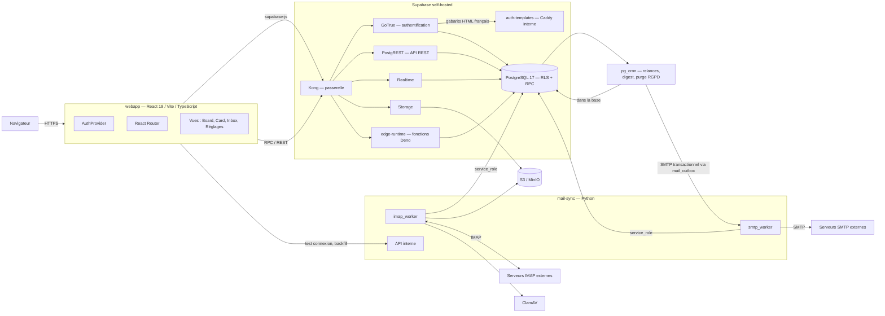
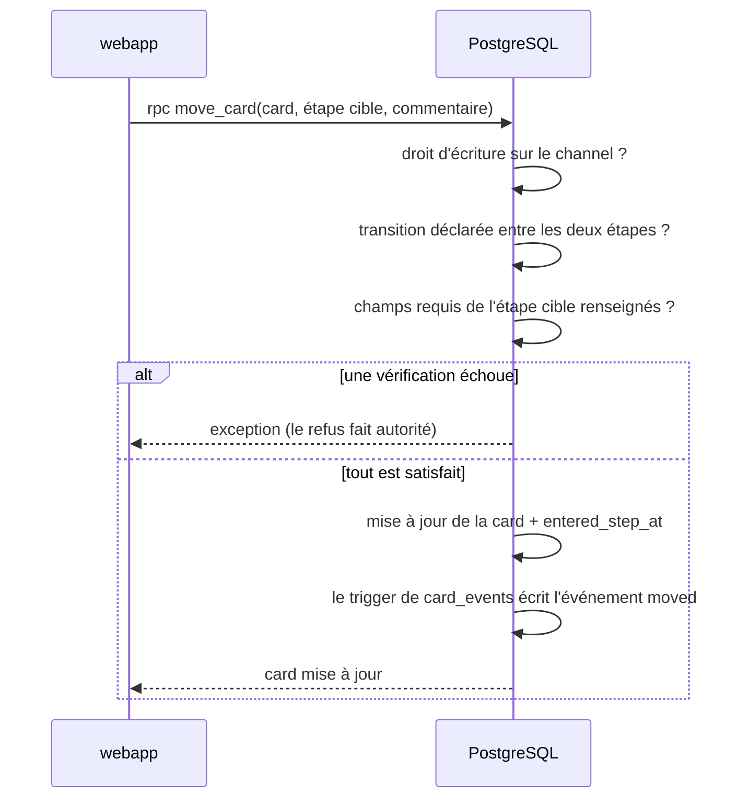
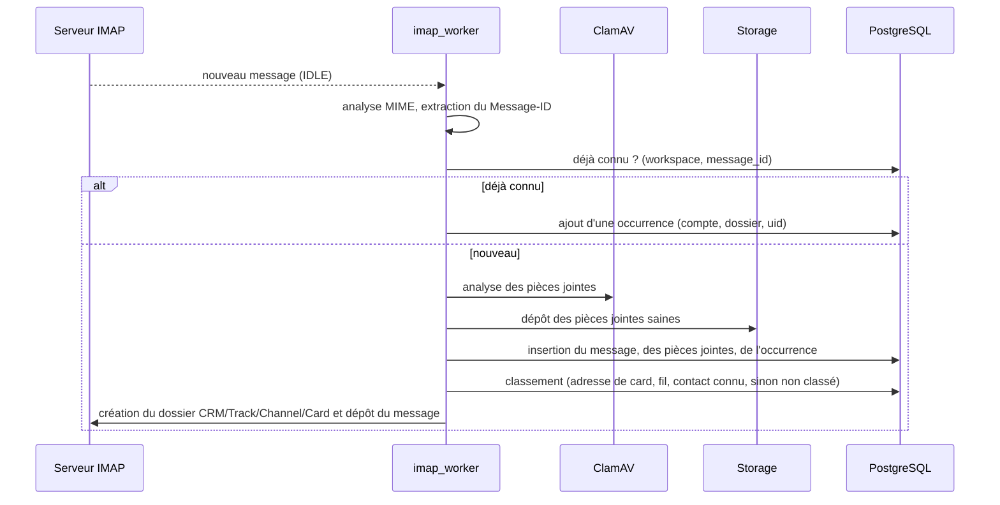

# Dossier d'architecture technique — P2Enjoy CRM

Document de référence de l'architecture. Toute évolution du schéma, des services déployés, des
fonctions backend ou des variables d'environnement met ce fichier à jour **dans le même
changement** que le code.

- Unité de backlog de référence : `CRM-000` (socle documentaire) — voir `docs/MASTER_PLAN.md`.
- Documents liés : `docs/SCHEMA.md`, `docs/SPEC-permissions-rls.md`,
  `docs/SPEC-workflow-engine.md`, `docs/SPEC-form-composer.md`, `docs/SPEC-mail-subsystem.md`,
  `docs/SPEC-edge-functions.md`, `docs/PROD_MIGRATIONS.md`.

---

## 1. Contexte et objectifs

P2Enjoy CRM est un outil interne de suivi de projets commerciaux. Il doit permettre à une
petite équipe (administrateurs et business developers) d'organiser librement son suivi en
**Tracks** et **Channels**, de faire avancer des **Cards** dans des workflows différents selon
le canal, et de conserver dans chaque card la correspondance email associée.

Contraintes structurantes :

- **Auto-hébergement.** Supabase self-hosted, pile entièrement dockerisée, aucun service cloud
  obligatoire en développement.
- **Règles métier côté base.** Les autorisations et les gardes de workflow sont appliquées en
  PostgreSQL, jamais uniquement dans l'interface.
- **Messagerie réelle.** Le développement utilise un vrai serveur IMAP/SMTP, pas une simulation.
- **Flexibilité de l'organisation.** L'arborescence Track/Channel et les workflows sont des
  données, pas du code.

## 2. Vue d'ensemble

## 3. Composants

### 3.1 `webapp` — interface

React 19 + Vite 8 + TypeScript + Tailwind 4. Responsabilités :

- Authentification via `supabase-js` (GoTrue). L'arbitrage de persistance est rendu par
  `docs/SPEC-auth.md` §9 : **`sessionStorage` uniquement**, limité à l'onglet, avec repli mémoire
  si ce stockage est indisponible. Le défaut `localStorage` de la bibliothèque n'est jamais
  employé. Ce contrat referme INC-022 et appartient à l'unité dédiée `CRM-009`, selon l'arbitrage
  du responsable — `docs/JOURNAL.md`, décision 253, INC-021. `CRM-011` reste propriétaire du
  mécanisme GoTrue éprouvé hors interface.
- Lecture des données par PostgREST, **écritures métier par RPC** lorsqu'une règle doit être
  appliquée (transition de card, copie de workflow, envoi d'email).
- Abonnements Realtime pour les commentaires, les déplacements de cards et les notifications.
  **LIVRÉ POUR LES SEULS COMMENTAIRES depuis `CRM-043`**, et par un mécanisme qu'aucun document ne
  nommait : une table n'est diffusée que si elle appartient à la publication `supabase_realtime`.
  MESURÉ le 2026-08-05 avant `CRM-043` : cette publication ne portait **aucune** table, et cette
  ligne annonçait donc depuis le socle documentaire un flux que rien ne branchait.
  `public.card_comments` y est ajoutée par la migration 15 ; les cards et les notifications
  restent dues par leurs unités. `realtime.apply_rls` évalue la politique `SELECT` de la table
  pour chaque abonné : **le temps réel est une surface d'autorisation**, et se prouve comme telle
  (`docs/SPEC-cards.md` §13.9).
- Aucune règle d'autorisation propre : l'interface masque ce que le backend refuserait, mais le
  refus fait toujours autorité.

Découpage prévu : `src/lib` (client Supabase, types générés, helpers), `src/features/<domaine>`
(board, card, inbox, workflow, réglages), `src/components/ui` (composants du design system),
`src/routes`.

**Livré à ce jour** (`CRM-006` puis `CRM-007`, `docs/SPEC-webapp.md`) :

- `src/lib/database.types.ts` — les types dérivés du schéma, **générés et versionnés** ;
  `npm run types:check` prouve qu'ils n'ont pas dérivé du schéma réellement migré ;
- `src/lib/supabase.ts` — le client, typé par ce schéma, avec session limitée à
  **`sessionStorage`**, repli mémoire, rafraîchissement automatique et consommation des fragments
  GoTrue (`CRM-009`, `docs/SPEC-auth.md` §9). Aucun jeton ne passe dans `localStorage` ;
- `src/lib/async.ts`, `src/lib/workspaces.ts`, `src/lib/tracks.ts`, `src/lib/channels.ts` — un type
  somme unique pour tout chargement, et les lectures que l'application effectue : le contexte
  d'espace de travail pour l'en-tête, les tracks pour la barre latérale (`CRM-020`), et — sur la
  route d'un track — sa résolution par slug puis ses channels pour la barre d'onglets (`CRM-021`).
  Ces deux dernières sont **séquentielles**, la seconde ayant besoin de l'identifiant que la
  première rapporte, et la seconde n'est pas émise lorsque le track n'est pas consenti.
  `channels.ts` porte aussi `projeterChannels`, qui transpose un état *de contenu de track* en état
  *de channels* : elle est partagée depuis que **deux** routes portent un track courant — celle
  d'un track et celle d'une card (`CRM-037`, `docs/SPEC-channels.md` §5.4) —, et non recopiée dans
  chacune ;
- `src/app/RouteTrack.tsx` — la route `/tracks/:slugTrack[/:slugChannel]`, hors de la table
  statique de `routes.tsx` : son titre est une **donnée** (le nom du track) et non une clé de
  traduction, et son contenu dépend de paramètres d'URL. Depuis `CRM-041`, elle rend le **board**
  du channel ouvert, et détient l'état de ses cards — le déplacement optimiste et son retour
  arrière remplacent la liste entière, qu'un état interne au board perdrait à chaque rechargement.
  Depuis `CRM-042`, la **même** route porte la seconde lecture d'un channel, la vue liste, montée
  sur `/tracks/:slugTrack/:slugChannel/liste` : même coquille, même résolution de track, seule la
  zone principale change. La bascule entre les deux vues est rendue **au-dessus** des deux, pour
  rester atteignable pendant un chargement, sur un état vide et sur un état d'erreur ;
- `src/lib/valeur-renseignee.ts` — « renseigné » au sens de `docs/SPEC-form-composer.md` §6.6, et
  le **tableau de cas partagé** du §4.3. Seul dans son fichier, sans React ni DOM : la preuve d'API
  appartient à un autre projet TypeScript et doit pouvoir l'importer plutôt que le recopier
  (`CRM-037`) ;
- `src/lib/formulaire.ts` — la composition du formulaire d'une étape : champs du workflow, règles
  de l'étape courante, valeurs de la card, réparties dans les trois destinations du §4.2. Les
  quatre lectures qui suivent la card sont **parallèles**, ne dépendant que d'elle (`CRM-037`) ;
- `src/app/FormulaireCard.tsx` — le rendu de ce modèle, sans aucune règle de visibilité dans le
  JSX, et `src/app/RouteCard.tsx` — la route `/tracks/:slugTrack/:slugChannel/cards/:idCard`, seul
  hôte possible du formulaire. Aucune écriture de réponse n'est livrée dans cette fiche ; les
  contrôles sont donc indisponibles et le disent (`CRM-037`). Cette route porte
  **deux chargements indépendants** : la card et son formulaire d'un côté, le track porteur et ses
  channels de l'autre, pour que la barre d'onglets soit celle du §4 du design system
  (`docs/SPEC-form-composer.md` §4.6 bis) ;
- `src/lib/colonnes-board.ts` — les quatre chaînes `select` du board, **seules dans leur fichier et
  sans aucun import**. Même motif que `valeur-renseignee.ts` : la preuve d'API appartient à un autre
  projet TypeScript, qui n'a ni `vite/client` ni les types du DOM, et doit pouvoir les importer
  plutôt que les recopier — un test qui redéclarerait sa requête prouverait qu'une requête
  quelconque fonctionne, pas que celle du produit fonctionne (`CRM-041`) ;
- `src/lib/board.ts` — la composition du board : colonnes à partir des **étapes** et non des cards,
  ordre, cumuls par devise, ancienneté dans l'étape, index des transitions atteignables,
  classification des sept refus de `move_card`, et l'appel de cette garde — seul chemin d'écriture
  de l'étape d'une affaire. Les **quatre** lectures sont parallèles, ne dépendant que du channel et
  de son workflow (`CRM-041`, `docs/SPEC-workflow-engine.md` §7.2) ;
- `src/app/Board.tsx` — le rendu de ce modèle : colonnes, cartes, glisser-déposer natif HTML5, menu
  des transitions déclarées, saisie du motif exigé, retour arrière après refus. Aucune règle n'y
  vit : le composant décide de l'apparence et du geste, jamais de ce qui est permis (`CRM-041`) ;
- `src/lib/colonnes-liste.ts` — les colonnes de la page de la vue liste, son **pas de pagination**
  et le code du `416`, seuls dans leur fichier et **sans aucun import**, pour le motif de
  `colonnes-board.ts` (`CRM-042`) ;
- `src/lib/liste-cards.ts` — la composition de la vue liste : clôture des quatre clés de tri,
  **ordre total** terminé par la clé primaire, repli des paramètres d'adresse, bornage du rang de
  page, découpage en pages, classification du `416` de PostgREST, et la lecture paginée. Elle
  **importe** la lecture des étapes du board plutôt que de la réécrire. **Deux** requêtes, non
  quatre : la liste n'offre aucun déplacement, donc ni transitions ni champs à lire (`CRM-042`,
  `docs/SPEC-cards.md` §12.3) ;
- `src/app/ListeCards.tsx` — le rendu de ce modèle : tableau sémantique, tri par en-tête avec
  `aria-sort`, filtres par étape et par recherche plein texte, pagination, et la bascule
  board ↔ liste. Aucune règle n'y vit, et **aucun chemin d'écriture** n'y est ouvert : la liste
  lit (`CRM-042`) ;
- `src/app/presentation-tracks.ts` — la correspondance jeton de couleur → classes et nom d'icône →
  composant Lucide, à un seul endroit, avec ses replis documentés ;
- `src/app/`, `src/components/ui/`, `src/i18n/`, `src/styles/tokens.css` — la coquille, les
  composants du design system, le dictionnaire, et les jetons ;
- `webapp/Dockerfile` et le service `webapp` de l'overlay de développement — Vite sur
  `node:24-alpine`, seul endroit où le prérequis Node du dépôt est réellement exercé.

Le build de production est produit **sur l'hôte** par `npm run build` et servi par Caddy : aucune
image de production n'est fabriquée pour des fichiers statiques.

Reste dû dans l'état documentaire présent : le reste du métier — `CRM-051` et suivantes.

**Conséquence structurante, révisée par `CRM-011` puis `CRM-022`.** La webapp restaure la session
avant toute lecture. Un anonyme garde les vrais états vides ; un membre lit ses données métier,
son workspace, ses memberships et les profils de son équipe. Le contexte et les personnes sont
donc nommés sans qu'aucun droit soit calculé côté navigateur.

**Choix structurant, mesuré :** les espaces de noms de Tailwind sont remis à zéro dans
`tokens.css`, de sorte qu'une couleur ou un espacement hors design system **n'existe pas** comme
classe. Le corollaire est qu'une classe dont le jeton manque n'est pas engendrée, en silence ; un
contrôle du harnais vérifie donc que chaque classe citée existe dans le CSS produit
(`docs/DESIGN_SYSTEM.md` §11).

Ces types décrivent le schéma, **jamais les droits** : une table en refus par défaut se type
exactement comme une table ouverte. L'interface ne peut donc déduire aucune autorisation d'un
type, ce qui est cohérent avec le principe ci-dessus — le refus fait toujours autorité côté
backend.

### 3.2 `db` — PostgreSQL 17

Source de vérité du produit. Contient :

- le schéma applicatif (voir `docs/SCHEMA.md`) ;
- les politiques **RLS** de chaque table ;
- les fonctions `SECURITY DEFINER` d'autorisation (`app.is_workspace_admin`,
  `app.can_read_channel`, `app.can_write_channel`, …) ;
- les RPC métier (`move_card`, `move_card_to_channel`, `copy_workflow_to_track`, `queue_outbound_email`, …) ;
- les triggers d'audit et de timeline (`card_events`).

Les migrations sont appliquées au démarrage par le conteneur `migrations-runner`, qui rejoue en
ordre lexicographique les fichiers de `supabase/migrations/`, une transaction par fichier, en
s'arrêtant à la première erreur. Il démarre après GoTrue, dont le schéma `auth` est référencé dès
les migrations d'amorçage, et après `storage`, dont le schéma (`storage.buckets`, référencé par
`CRM-054` depuis la migration 24) n'existe qu'une fois la migration interne du service jouée ;
`rest` attend à son tour que `migrations-runner` se soit terminé avec succès. **Cet ordre casse un
cycle mesuré** (`docs/JOURNAL.md` décision 342) : `storage` ne dépend plus de `rest` au démarrage —
sa propre migration ne parle qu'à `db`, et `POSTGREST_URL` ne sert qu'aux requêtes proxy, bien après
le démarrage —, faute de quoi `migrations-runner` → `storage` → `rest` → `migrations-runner`
formait un verrou que Compose refuse même de tenter sur un volume neuf.

Le rôle par défaut reste `postgres`. Une migration qui doit administrer un objet détenu par
Supabase peut porter `-- @migration-role: supabase_admin` ; le runner n'autorise **que** ce rôle
explicite et refuse tout autre marqueur. `0018_pg_cron.sql` est l'unique cas actuel : elle ferme
les ACL de l'extension sous leur propriétaire, puis exécute `SET ROLE postgres` avant de créer les
objets applicatifs et le job. `scripts/verify-scripts.sh` éprouve le choix et son refus.

En production, ce chemin est **désactivé** par `APPLY_MIGRATIONS=false` : les migrations y sont
appliquées sur instruction humaine explicite, selon `docs/PROD_MIGRATIONS.md`. Le conteneur se
contente alors de renvoyer vers ce document et se termine avec le code `0`.

**Toute migration du dépôt est idempotente.** Le conteneur ne tient aucun registre des migrations
déjà appliquées : il rejoue l'intégralité du répertoire à chaque démarrage de la pile. Une
migration qui échouerait au second passage bloquerait `rest`, qui attend sa terminaison réussie.
Ce choix — pas de table de suivi, mais des migrations rejouables — est motivé dans
`docs/JOURNAL.md`, décision 20 ; il est vérifié par `scripts/verify-migrations.sh`, qui réapplique
la migration sur une base déjà migrée et compare la structure obtenue.

**Une table naît en refus.** Toute table métier créée par une migration active RLS dans la même
migration. Tant que ses politiques ne sont pas livrées, elle ne retourne aucune ligne et refuse
toute écriture. Les privilèges de table sont posés explicitement, sans s'en remettre aux
privilèges par défaut de l'image : `SELECT` est accordé à `anon` et `authenticated` afin qu'un
refus de lecture se manifeste par zéro ligne et non par une erreur de privilège
(`docs/SPEC-permissions-rls.md` §7).

### 3.3 `mail-sync` — service Python

Seul composant autorisé à parler IMAP et SMTP. Quatre responsabilités :

| Sous-composant | Rôle |
|---|---|
| `imap_worker` | Une connexion IDLE par compte entrant ; récupération, analyse, dédoublonnage, dépôt des pièces jointes, classement, création des dossiers imbriqués |
| `smtp_worker` | Consommation de la file `mail_outbox` : envoi via l'identité SMTP de l'utilisateur, retry avec backoff, respect des quotas, archivage du message envoyé |
| ~~`scheduler`~~ | **Retiré du périmètre** par la décision 261. Relances, séquences, digest, purge RGPD et recalcul du score de santé passent à `pg_cron` — `CRM-017` |
| API interne | Test de connexion IMAP/SMTP, déclenchement d'un backfill, exposition de l'état de synchronisation, et endpoints réservés aux tests en environnement de développement |

Il se connecte à PostgreSQL avec le rôle `service_role`. C'est **le seul** consommateur des
secrets de messagerie déchiffrés. Cette capacité était future : le socle `CRM-051` ne recevait pas
la clé de service tant qu'il ne consommait aucune table, et **`CRM-052` est l'unité qui la lui
donne**, avec son contrat d'accès exact.

**Le chemin d'accès aux secrets, en toutes lettres.** `mail-sync` parle à PostgREST, jamais
directement à PostgreSQL, et PostgREST **n'expose pas le schéma `vault`**. Le déchiffrement passe
donc par `app.mail_inbound_account_credentials`, fonction `SECURITY DEFINER` dont l'exécution est
révoquée à `public`, `anon` et `authenticated`, et accordée au seul `service_role`. C'est l'unique
voie par laquelle un mot de passe de messagerie sort de la base, et elle est éprouvée dans les deux
sens : elle rend le secret au service, elle est refusée à tout le reste
(`docs/SPEC-mail-subsystem.md` §13.5).

**Socle livré par `CRM-051`.** Le service commun dev/prod emploie Python 3.13.13,
FastAPI 0.139.2, Starlette 1.3.1, Uvicorn 0.51.0 et Pydantic Settings 2.14.2. Aucun port n'est publié sur l'hôte :
deux sondes minimales et le statut authentifié ne sont joignables que sur le réseau Compose.
L'API de preuve `dev/checkpoint`, également authentifiée, est absente en production.

Un volume nommé conserve un état **strictement opérationnel** écrit atomiquement : version de
schéma, compteur/identifiant de démarrage et checkpoint de développement. Il ne porte jamais de
message, secret, UID ou donnée utilisateur ; ces états métier restent en PostgreSQL et Storage.
Un fichier corrompu bloque le démarrage plutôt que d'être réinitialisé. Le conteneur tourne sans
privilège, en racine lecture seule, capacités retirées, et ses journaux sont des objets JSONL UTC
sans en-têtes, jetons ni corps. Une configuration refusée nomme la variable et la règle, jamais la
valeur, et termine le processus avec le code `78` avant toute écoute (décision 313). Contrat
exhaustif : `docs/SPEC-mail-subsystem.md` §12 ; preuves : `scripts/verify-mail-sync.sh` et
`e2e/mail/mail-sync.spec.ts`.

**Ordre de démarrage** (`docs/JOURNAL.md` décision 351) : `mail-sync` déclare `depends_on: kong`
et `rest`, tous deux `condition: service_healthy`. Sa boucle de veille (§20.10) s'amorce avec le
conteneur ; sans cette garde, son premier tour pouvait s'exécuter avant que l'API ne réponde et
journalisait `veille_source_indisponible` en `WARNING` — une console censée rester silencieuse à
l'amorçage (`e2e/mail/mail-sync.spec.ts` S3) pour une pile simplement pas encore prête, non pour
un compte réellement en panne.

**Choix : `pg_cron`, et non un ordonnanceur applicatif.** Arbitrage du responsable —
`docs/JOURNAL.md`, décision 261, INC-012. **La décision 8 est renversée**, pas seulement corrigée
dans son énoncé.

Elle reposait sur deux motifs. `CRM-004` a **démenti le premier** par la mesure : `pg_cron`
**1.6.4 est présent, préchargé et fonctionnel** dans l'image épinglée. Seul le motif de testabilité
subsistait — et il ne pèse pas contre le compromis qui était écrit noir sur blanc au §12 : « les
tâches planifiées s'arrêtent si le service s'arrête ». Pour des relances commerciales, un digest
quotidien et une purge RGPD, c'est coûteux : **une purge RGPD qui ne s'exécute pas est un
manquement, pas un retard.**

`pg_cron` s'exécute là où vivent les données et là où vivent déjà les règles métier — une seule
source de vérité, comme pour le reste du produit. Compromis assumé : les tâches planifiées
deviennent testables par **pgTAP** plutôt que par pytest.

**Mise en œuvre : `CRM-017`.** Le contrat d'exécution est fixé dans
`docs/SPEC-scheduler.md` : les jobs sont des configurations de base versionnées, privées et
nommées. Un heartbeat opérationnel rend l'exécution observable immédiatement après une migration,
puis revient à une cadence horaire ; les relances, digests et purges métier ne sont enregistrés
que par les unités qui livrent leurs tables et leurs règles. `mail-sync` conserve ses trois autres
sous-composants : IMAP et SMTP demandent des connexions longues, et seul l'ordonnancement sort de
son périmètre.

### 3.4 `clamav`

Analyse chaque pièce jointe entrante avant sa mise à disposition. Une pièce jointe reste en
statut `pending` tant qu'elle n'est pas analysée et n'est jamais téléchargeable en statut
`infected`.

**Livré par `CRM-050`, mais dans l'overlay de développement seulement.** Son unique consommateur
est l'ingestion, livrée par `CRM-054` : déclarer aujourd'hui le service dans l'assemblage commun
imposerait à la production de tenir `healthy` un composant qu'aucun autre n'appelle. Le passage
dans `docker-compose.yml` est une **opération due**, inscrite dans `docs/PROD_MIGRATIONS.md` §4
sous l'unité qui l'appellera (`docs/JOURNAL.md`, décision 236). Ce n'est donc pas un composant de
développement : c'est un composant de production **pas encore déployé**, et c'est pourquoi il ne
figure pas au tableau du §3.6.

*Mesuré (`docs/SPEC-mail-subsystem.md` §11.6)* : les signatures sont embarquées dans l'image
épinglée. `clamd` détecte la chaîne de test EICAR sans qu'aucun téléchargement n'ait eu lieu, ce
qu'un simple `PING` ne prouverait pas. Sur un réseau fermé, `freshclam` échoue sans conséquence et
la base vieillit avec l'image : la production devra prévoir son rafraîchissement (§14).

### 3.5 Passerelle et périphérie

- **Kong** expose l'API Supabase (REST, Auth, Storage, Realtime et fonctions edge) sur un port
  unique. `/functions/v1/` exige une clé d'API valide puis route vers `functions` ; toute future
  autorisation métier reste appliquée par la fonction, jamais déduite de cette seule clé.
- **`functions`** exécute les fonctions Deno courtes et de confiance dans Supabase Edge Runtime.
  Le contrat de `CRM-016`, spécifié avant code dans `docs/SPEC-edge-functions.md`, borne chaque
  worker à 128 Mio / 10 s, emploie la politique silencieuse `oneshot`, ne publie aucun port
  hôte et réserve les connexions longues à `mail-sync`.
- **Caddy** (production uniquement) termine TLS et sert la webapp buildée.
- **`auth-templates`** emploie également `caddy:2.9-alpine`, mais comme serveur statique interne
  commun aux deux assemblages. Il sert en lecture seule les quatre gabarits français de GoTrue sur
  `:8080`, sans publier de port hôte ; `auth` attend sa sonde saine (`CRM-009`).

### 3.6 Composants de développement uniquement

| Composant | Rôle | Pourquoi il n'est pas en production |
|---|---|---|
| Supabase Studio | Inspection de la base | Outil d'administration, non exposé publiquement |
| `postgres-meta` | Introspection du schéma, consommée **uniquement** par Studio | Sans Studio, il n'a aucun consommateur |
| Inbucket | Puits des emails transactionnels | La production envoie réellement |
| Stalwart | Vrai serveur IMAP/SMTP local | La production utilise les serveurs des utilisateurs |
| `stalwart-init` | Provisionne les domaines et les boîtes de développement par la vraie API de gestion, puis s'arrête | Il ne provisionne que des boîtes de démonstration |
| Roundcube | Webmail de vérification visuelle | Outil de contrôle du développement |
| MinIO | S3 local | La production utilise son propre stockage objet |

Ces composants vivent exclusivement dans `docker-compose.dev.yml`. La passerelle **ne connaît
aucun d'entre eux** : Studio est joint directement sur son port, et il joint `postgres-meta` par
le réseau interne. La configuration de Kong est donc rigoureusement identique dans les deux
environnements, ce qui supprime toute divergence possible entre eux
(`docs/JOURNAL.md`, décision 11).

Le port HTTP de Stalwart reste nécessaire à son API de gestion. Sa racine ne télécharge toutefois
aucune console : elle sert un bundle statique local et versionné qui explique que l'administration
se fait par `/api/*`. Les réglages IMAP/SMTP modifiables sont écrits dans le magasin de
configuration par `stalwart-init`, puis rechargés par l'API ; le fichier local ne porte que les
clés d'infrastructure. `postgres-meta` conserve son healthcheck d'image, complété dans l'overlay
par une période de démarrage : `docker compose up --wait` ne doit pas confondre initialisation et
indisponibilité.

### 3.7 Versions épinglées

Aucune image n'est suivie par un tag mouvant. Toute évolution est un changement explicite qui
impose de rejouer `scripts/verify-stack.sh` et de mettre à jour `docs/PROD_MIGRATIONS.md` §4.

| Service | Image | Environnements |
|---|---|---|
| `db` | `supabase/postgres:17.6.1.136` | dev, prod |
| `migrations-runner` | `postgres:17-alpine` | dev, prod |
| `auth-templates` | `caddy:2.9-alpine` | dev, prod |
| `functions` | `public.ecr.aws/supabase/edge-runtime:v1.74.2` | dev, prod |
| `auth` | `supabase/gotrue:v2.189.0` | dev, prod |
| `rest` | `postgrest/postgrest:v14.12` | dev, prod |
| `realtime` | `supabase/realtime:v2.102.3` | dev, prod |
| `storage` | `supabase/storage-api:v1.60.4` | dev, prod |
| `kong` | `kong/kong:3.9.1` | dev, prod |
| `studio` | `supabase/studio:2026.07.07-sha-a6a04f2` | dev |
| `meta` | `supabase/postgres-meta:v0.96.6` | dev |
| `minio` | `minio/minio:RELEASE.2025-04-22T22-12-26Z` | dev |
| `minio-createbucket` | `minio/mc:RELEASE.2025-04-16T18-13-26Z` | dev |
| `inbucket` | `inbucket/inbucket:stable` | dev |
| `stalwart` | `stalwartlabs/stalwart:v0.13.4` | dev |
| `stalwart-init` | `curlimages/curl:8.16.0` | dev |
| `roundcube` | `roundcube/roundcubemail:1.6.11-apache` | dev |
| `clamav` | `clamav/clamav:1.4.3` | dev — **prod due avec `CRM-054`**, voir §3.4 |
| `mail-sync` | build local `python:3.13.13-slim-bookworm` | dev, prod |
| `caddy` | `caddy:2.9-alpine` | prod |

Deux familles de la distribution officielle restent **écartées** : `analytics` et `vector`
(journalisation Logflare), puis `imgproxy` (transformation d'images,
`ENABLE_IMAGE_TRANSFORMATION` à `false`). La décision 12 est renversée pour `functions` par la
décision 260 ; son contrat d'activation appartient à `CRM-016` et à la décision 283.

**`supavisor` a été retiré** par la décision 366, après avoir été livré avec `CRM-001`. Le pooler
n'avait aucun consommateur : les quatre services qui parlent SQL ouvrent leur propre pool vers `db`
en direct, `mail-sync` passe par PostgREST, et l'outillage SQL de l'hôte passe par
`POSTGRES_DIRECT_PORT`. Partent avec lui la base interne `_supabase`, le schéma `_supavisor`, le
mot de passe du rôle `pgbouncer` et les variables `POOLER_*` et `VAULT_ENC_KEY`. Le jour où un
client SQL éphémère apparaîtrait — runtime edge attaquant la base directement, accès SQL externe
en production — le pooler revient avec l'unité qui le réclame.

### 3.8 Contraintes d'exécution de l'hôte

Realtime élève son nombre de descripteurs de fichiers au démarrage. Le besoin est
exprimé par `STACK_RLIMIT_NOFILE` (défaut `10000`, ramené de `100000` par la décision 366 : la
valeur haute était celle de Supavisor) plutôt que laissé à un défaut de démon : un
hôte dont la limite dure est inférieure doit l'abaisser, faute de quoi ces deux services
redémarrent en boucle (`docs/JOURNAL.md`, décision 14).

Six autres suppositions sur l'hôte ont été mesurées fausses sur un poste WSL. Les six sont
désormais **gardées par les scripts** plutôt que subies (`docs/JOURNAL.md`, décisions 98 à 101,
255, 257 et 280). Chacune reste inerte là où elle ne s'applique pas, en particulier dans le
conteneur d'intégration.

| Supposition | Ce que fait le dépôt |
|---|---|
| Le magasin d'identifiants Docker répond | `require_docker` dérive une configuration Docker privée de tout assistant `.exe`, contexte et greffons conservés. Un assistant Windows joint par l'interopérabilité WSL rend une sortie vide sous les tirages parallèles de Compose |
| Les ports de l'assemblage sont libres | `require_free_ports` refuse avant tout démarrage, en nommant le port, son détenteur et la variable du fichier d'environnement. Aucun port n'est choisi à la place de l'opérateur. Sur un Linux minimal sans `ss` ni `netstat`, la garde lit `/proc/net/tcp` et `/proc/net/tcp6`, sans confondre un port fermé avec un listener |
| `localhost` désigne IPv4 dans un conteneur | Le contrôle de santé de `storage` vise `127.0.0.1` : le service n'écoute qu'en IPv4, et `/etc/hosts` résout aussi `localhost` en `::1` |
| L'hôte peut effacer ce que la pile a écrit | `resetMe.sh` détruit le cluster PostgreSQL par un conteneur jetable ; `ensure_host_mountpoints` crée `node_modules` avant Compose, faute de quoi le démon le crée en `root` dans le dépôt de l'utilisateur |
| Le contexte de build peut lire tout le dépôt sans fuite | Le `.dockerignore` racine exclut `.env`, `.git`, les dépendances et sorties générées, ainsi que `supabase/docker/volumes/` ; le `COPY . .` de l'image de développement ne reçoit donc ni secret local ni données PostgreSQL fermées en `0750` |
| Le registre npm présente une chaîne TLS publique | `CRM-015` transporte comme secret BuildKit le fichier PEM externe désigné par `NPM_CA_FILE`, après validation avant Docker. Absent ou vide, `/dev/null` garde le build strictement inerte ; le secret ne persiste jamais dans l'image |
| PyPI présente une chaîne TLS publique | Même dispositif pour l'image `mail-sync`, par le secret `pip_ca` et la variable `PIP_CA_FILE` (décision 356, INC-093). Le secret est déclaré dans `docker-compose.yml`, avec le service, et non dans l'overlay de développement : la production construit la même image. `${PIP_CA_FILE:-/dev/null}` garde la branche inerte par défaut |

## 4. Flux principaux

### 4.1 Authentification et session

1. L'utilisateur s'authentifie par email et mot de passe auprès de GoTrue.
2. GoTrue émet un JWT contenant `sub` (l'identifiant utilisateur).
3. `supabase-js` joint ce JWT à chaque requête ; PostgREST le transmet à PostgreSQL, qui
   positionne `auth.uid()`.
4. Les politiques RLS résolvent les droits **à partir des tables d'appartenance**, pas de
   revendications portées par le jeton : un droit révoqué prend effet immédiatement, sans
   attendre l'expiration du JWT.
5. Après une invitation ou une autre action transactionnelle, le destinataire clique le lien
   GoTrue reçu par SMTP. La webapp consomme son fragment, valide l'utilisateur, nettoie l'URL puis
   conserve la session uniquement dans le `sessionStorage` de cet onglet (`CRM-009`).

L'inscription libre est désactivée : `POST /signup` est refusé par `422 signup_disabled`, et
**le privilège ne contourne pas ce refus** — la clé `service_role` est refusée à l'identique
(mesuré, `docs/JOURNAL.md`, `CRM-011`). Les comptes sont créés par invitation.

L'émission d'une invitation exige un jeton `service_role`, que la webapp ne détient jamais : c'est
donc aujourd'hui une opération d'**exploitation** et non un parcours produit. Le composant qui
porterait ce parcours n'existe pas et n'est rattaché à aucune unité (INC-015). Le détail complet
du cycle de vie d'un compte — invitation, acceptation, connexion, session, déconnexion,
réinitialisation — est spécifié dans `docs/SPEC-auth.md`.

### 4.2 Déplacement d'une card dans son workflow

Le glisser-déposer du board appelle exactement la même RPC : aucun chemin d'écriture ne
contourne les gardes.

**L'événement n'est pas écrit PAR `move_card`, mais par un trigger de `cards`** (`CRM-044`,
`docs/JOURNAL.md` décision 203). La différence compte : `owner_id`, `archived_at` et `deleted_at`
s'écrivent par un `PATCH` direct qu'aucune RPC ne médie, et une trace placée dans les fonctions
laisserait sans mémoire l'archivage, la corbeille et le changement de responsable. Le §3.2 de ce
document — « les triggers d'audit et de timeline » — est celui des deux formulations que
l'implémentation suit à la lettre.

### 4.3 Réception d'un email

Le dédoublonnage par `Message-ID` est indispensable : un même message peut arriver à la fois
dans la boîte système et dans la boîte personnelle mirroir d'un utilisateur.

### 4.4 Envoi d'un email

L'interface n'envoie jamais directement. Elle appelle `queue_outbound_email(...)`, qui insère
une ligne dans `mail_outbox`. `smtp_worker` la consomme, envoie via l'identité SMTP choisie
(`From` = adresse interne de l'utilisateur, `Reply-To` = adresse de la card), puis archive le
message envoyé. Une panne SMTP ne perd donc aucun message : elle repousse la tentative.

## 5. Modèle de données

Le modèle complet, colonne par colonne, est décrit dans **`docs/SCHEMA.md`**. Familles :

| Famille | Contenu |
|---|---|
| Identité et tenancy | `profiles`, `workspaces`, `workspace_members`, `track_members`, `channel_members` |
| Organisation | `tracks`, `channels` |
| Workflows | `workflow_nodes_catalog` (livrée, `CRM-030`), `workflows`, `workflow_steps`, `workflow_transitions` (livrées, `CRM-031`) ; `workflow_transition_required_fields`, liaison normalisée et intègre vers le formulaire (livrée, `CRM-018`) ; vue `workflow_derivations` et fonction `copy_workflow_to_track` (`CRM-032`, redéfinies par `CRM-018` pour copier champs, règles et exigences et comparer une empreinte de composition) ; fonction `move_card`, **garde centrale de transition** (livrée, `CRM-034`, **six vérifications sur six** depuis `CRM-036` qui a refermé INC-047) ; fonction `move_card_to_channel`, **déplacement d'une card d'un graphe à un autre** (livrée, `CRM-045`) ; fonction `change_channel_workflow`, **remappage atomique et exhaustif de toutes les cards d'un channel** (livrée, `CRM-019`) — aucune étape n'est devinée et toute perte de réponse exige `discard_field_values` |
| Formulaires | `form_fields`, `form_field_rules` (livrées, `CRM-035`) ; `card_field_values` (livrée, `CRM-036`), sa validation par type par trigger, et les fonctions `app.valeur_de_champ_est_vide` et `app.can_write_card` |
| Cards | `cards` (livrée, `CRM-040`) ; `card_comments` (livrée, `CRM-043`) ; `card_events` (livrée, `CRM-044` — **append-only**, alimentée par cinq triggers, aucune écriture cliente) ; `card_activities`, `card_tags`, `card_watchers`, `card_checklists`, `card_templates` — ces cinq dernières ne sont rattachées à aucune unité |
| Relations | `organizations`, `contacts`, `card_contacts` |
| Messagerie | `mail_inbound_accounts`, `mail_outbound_identities`, `mail_messages`, `mail_message_occurrences`, `mail_attachments`, `mail_outbox`, `mail_folder_map`, `mail_templates`, `mail_sequences`, `card_sequence_enrollments` |
| Transverse | `notifications`, `notification_preferences`, `audit_log`, `api_tokens`, `webhook_endpoints`, `webhook_deliveries`, `saved_views` |

Les preuves rejouables des quatre surfaces du chunk 3 sont nommées avec leur architecture :
`scripts/verify-formulaire.sh`, `scripts/verify-commentaires.sh`, `scripts/verify-timeline.sh` et
`scripts/verify-move-card-to-channel.sh`. Le remappage global qui complète cette dernière capacité
est éprouvé par `scripts/verify-change-channel-workflow.sh` (legacy, OID, JWT, concurrence et
restauration).

## 6. Interfaces

| Interface | Consommateur | Nature |
|---|---|---|
| PostgREST | webapp | REST généré depuis le schéma, filtré par RLS |
| RPC PostgreSQL | webapp | Écritures métier soumises à garde |
| Realtime | webapp | Abonnements aux commentaires — **livré `CRM-043`**, `public.card_comments` publiée sur `supabase_realtime`. Cards et notifications : dues par leurs unités |
| Storage | webapp, mail-sync | Pièces jointes et documents |
| Fonctions edge | webapp, futurs appels serveur | `POST /functions/v1/<fonction>` par Kong ; clé d'API obligatoire, autorisation métier dans chaque fonction privilégiée |
| API interne mail-sync | sondes d'infrastructure dans `CRM-051`; façade serveur future pour la webapp | Santé et statut interne authentifié ; test de connexion, backfill et synchronisation arrivent avec leurs unités, sans exposition directe au navigateur |
| Webhooks sortants | Systèmes tiers | Événements signés (unité de backlog dédiée) |
| API publique par jeton | Systèmes tiers | Lecture/écriture à portée limitée (unité de backlog dédiée) |

## 7. Authentification et autorisation

- **Authentification** : GoTrue, email et mot de passe, inscription libre désactivée,
  invitations émises avec un droit d'administration. Spécifiée par `docs/SPEC-auth.md`, prouvée
  hors interface par `scripts/verify-auth.sh` (**62 contrôles**, dont service et contenu réel des
  gabarits français). Le retour destinataire est en plus exercé dans Chromium par `CRM-009`.
- **Politique de mot de passe** : longueur minimale de 12 caractères (`PASSWORD_MIN_LENGTH`),
  sans exigence de composition. Le défaut de GoTrue, 6, a été mesuré comme réellement permissif
  (`docs/JOURNAL.md`, décision 29).
- **Rôles de workspace** : `admin`, `business_developer`, `viewer`.
- **Droits fins** : `track_members` et `channel_members` accordent l'accès à un sous-arbre.
- **Application** : politiques RLS sur toutes les tables, appuyées sur des fonctions
  `SECURITY DEFINER` afin d'éviter la récursion des politiques. Que ces fonctions évitent
  réellement la récursion est **mesuré**, non supposé : la suite pgTAP de `CRM-010` la provoque
  d'abord de deux façons — `42P17` par une politique auto-référente, `54001` par une jumelle
  `SECURITY INVOKER` — puis exécute la même politique adossée à la fonction livrée, qui répond
  sans erreur (`docs/JOURNAL.md`, décision 27).
- **Les droits ne sont pas portés par le jeton** : les fonctions relisent `workspace_members` à
  chaque appel, donc une révocation prend effet immédiatement. Mesuré sous PostgREST avec un jeton
  toujours valide par `scripts/verify-authz.sh`.
- **État de livraison** : `app.workspace_role`, `app.is_workspace_member`,
  `app.is_workspace_admin` et `app.resolve_access` sont livrées par `CRM-010`. Les quatre
  fonctions `can_*` restent différées — `docs/INCONSISTENCY_REPORT.md`, INC-013.
- **Premières politiques RLS du produit** : `CRM-020` en pose trois sur `public.tracks`,
  `CRM-021` trois sur `public.channels`, `CRM-030` trois sur `public.workflow_nodes_catalog`,
  `CRM-031` **neuf** sur les trois tables de workflow et `CRM-035` **sept** sur les deux tables de
  formulaire —
  lecture par `app.is_workspace_member`, insertion et mise à jour par `app.is_workspace_admin`,
  **aucune suppression**. Prouvées hors interface avec les jetons réels des trois profils seedés
  par `scripts/verify-tracks.sh` (**43 contrôles**), `scripts/verify-channels.sh`
  (**30 contrôles**), `scripts/verify-catalogue.sh` (**36 contrôles**),
  `scripts/verify-workflows.sh` (**47 contrôles**, 40 hors suites),
  `scripts/verify-copie-workflow.sh` (**33 contrôles**, 26 hors suites),
  `scripts/verify-coherence-workflow.sh` (**33 contrôles**, 26 hors suites),
  `scripts/verify-champs-formulaire.sh` (**37 contrôles**, 30 hors suites),
  `e2e/api/tracks.spec.ts`, `e2e/api/channels.spec.ts`, `e2e/api/catalogue-noeuds.spec.ts`,
  `e2e/api/workflows.spec.ts`, `e2e/api/copie-workflow.spec.ts`,
  `e2e/api/coherence-workflow.spec.ts` et `e2e/api/champs-formulaire.spec.ts`.

  **Depuis `CRM-035`, un formulaire appartient à un workflow.** Les champs et leurs règles de
  visibilité suivent la même règle d'accès que les workflows — lecture par les membres, écriture par
  les administrateurs —, avec une asymétrie de suppression : une **règle** se supprime, un **champ**
  s'archive, et aucun privilège `DELETE` ne lui est accordé (décision 96). Une règle ne peut pas
  croiser deux workflows : trois clés étrangères composites l'en empêchent structurellement, et non
  un trigger (décision 95). `visibility = 'required'` reste cependant une **déclaration sans
  garde** : ce qui l'applique est `move_card`, non commencée faute de cible (INC-043).
  **RÉSOLU PAR `CRM-036`** : `move_card` est livrée et porte sa sixième vérification ; un champ
  déclaré `required` est désormais réellement exigé à l'entrée dans son étape, et le refus nomme les
  clés manquantes dans le `DETAIL` de l'erreur (`docs/SPEC-form-composer.md` §6.7).

  **Depuis `CRM-033`, un channel ne peut plus naître sans workflow**, et le workflow qu'il désigne
  doit être `global` ou rattaché à **son** track. La règle est portée par deux triggers — un sur
  `public.channels`, un sur `public.workflows` — parce que la mesure a établi que deux des quatre
  écritures capables de la casser ne passent pas par `channels` (INC-040, décision 89). Elle
  s'**ajoute** aux autorisations et ne les remplace pas : un `business_developer` est refusé par la
  politique RLS avant même que la règle ne soit évaluée, faute de quoi un refus de rôle deviendrait
  un refus d'intégrité qui apprendrait au demandeur ce que contient la base.
  Sur les workflows, la suppression physique est **exposée aux étapes et aux transitions**, et à
  elles seules : elles sont la composition d'un workflow et n'ont aucun `archived_at`
  (`docs/JOURNAL.md`, décision 74). C'est le seul endroit du produit livré où un client peut
  supprimer une ligne.
  **`CRM-032` n'ajoute aucune politique** : elle livre une fonction `SECURITY DEFINER`, qui
  contourne la RLS par construction, et porte donc sa règle d'accès dans un **contrôle explicite**
  — administrateur du workspace, vérifié après la visibilité de la ligne, pour qu'un workflow d'un
  autre workspace rende « introuvable » et non « interdit » (`docs/JOURNAL.md`, décision 82). Sa
  vue `workflow_derivations` est `security_invoker = true` : elle n'ajoute aucun droit, elle relit
  les tables avec ceux de l'appelant.
  Sur `tracks` et `channels`, ces politiques appliquent les **droits fins** depuis `CRM-012` :
  `app.can_read_track`, `app.can_read_channel` et `app.can_write_channel` sont livrées, INC-024 et
  INC-030 sont closes. Les politiques n'appellent pas ces fonctions directement mais
  `app.resolve_track_access(workspace_id, id)` et `app.resolve_channel_access(...)`, qui prennent
  les colonnes de la ligne évaluée : **une politique qui relit sa propre table casse
  `insert … returning`**, donc toute écriture demandant `Prefer: return=representation`
  (`docs/SPEC-permissions-rls.md` §3.5, `docs/JOURNAL.md` décision 107). Les deux tables de droits
  fins portent elles-mêmes quatre politiques chacune — lecture par l'administration et par
  l'intéressé, écriture et suppression par l'administration (§4.1). Reste due
  `app.can_read_card`, jusqu'à `CRM-040`. Sur le **catalogue de nœuds**, l'absence de droit fin n'est pas un
  écart : `track_members` et `channel_members` portent sur un sous-arbre d'organisation, et le
  catalogue n'appartient ni à un track ni à un channel — sa politique s'arrête au rôle de
  workspace **par conception** (`docs/SPEC-workflow-engine.md` §2.7). Les tables d'identité, elles,
  restent en refus par défaut.
- **Le cloisonnement ne repose pas seulement sur les politiques.** `channels.workspace_id` est
  dénormalisé, et c'est lui que la politique interroge. `CRM-021` pose une clé étrangère
  **composite** `(track_id, workspace_id) → tracks (id, workspace_id)` qui rend impossible qu'un
  channel déclare un workspace différent de celui de son track. Sans elle, une donnée fausse ferait
  cloisonner la RLS sur une valeur fausse, et aucune politique ne le rattraperait
  (`docs/JOURNAL.md`, décision 60).
- **Secrets de messagerie** : la colonne portant la référence du secret est révoquée pour le
  rôle `authenticated`. Aucun chemin de lecture ne l'expose à un client.

Le détail, y compris la matrice des droits et les preuves de refus exigées, est dans
`docs/SPEC-permissions-rls.md`.

**Les douze preuves de refus sont inventoriées en un seul lieu depuis `CRM-014`.** Le fichier
`e2e/api/preuves-refus.spec.ts` (**40 scénarios**) les rejoue dans l'ordre du §7, avec les jetons
réels des trois profils, et `supabase/tests/0016_preuves_refus.test.sql` (**52 assertions**) tient
l'inventaire des **48 politiques** de `public` — nom par nom et par un compte. `CRM-018` a fermé
l'oubli des trois tables métier peuplées arrivées après l'inventaire initial : `card_comments`,
`card_events` et `workflow_transition_required_fields`. Le harnais
`scripts/verify-preuves-refus.sh` (**26 contrôles**, 21 hors suites) éprouve les deux dans les deux
sens : une politique **retirée** fait échouer l'inventaire pgTAP, une politique **permissive** fait
échouer les scénarios, et la restauration est comparée à l'inventaire relevé avant dégradation.

Sur les douze preuves, **sept sont acquises** — n° 1 à 5, n° 10 et n° 11 — et **cinq ne sont pas
encore entièrement satisfaisables** : la n° 8 refuse déjà l'écriture directe dans `card_events`,
mais attend toujours `audit_log`; restent aussi les deux tables de messagerie, les pièces jointes
et `queue_outbound_email`. Les absences restantes sont **figées par des assertions** qui
deviendront rouges à la naissance de leur objet. Depuis `CRM-022`, la n° 10 est acquise dans sa
règle : seuls les administrateurs gèrent les memberships et une contrainte différable refuse toute
suppression ou rétrogradation qui laisserait un workspace existant sans administrateur.

## 8. Chiffrement des secrets

Les mots de passe IMAP/SMTP sont chiffrés via **Supabase Vault** : l'application ne stocke
qu'un identifiant de secret, et seul `mail-sync` (rôle `service_role`) peut le déchiffrer.

**Point tranché par `CRM-004`** (`docs/JOURNAL.md`, décision 23). L'extension `supabase_vault`
**0.3.1 est présente dans l'image épinglée** `supabase/postgres:17.6.1.136` : déjà installée,
préchargée par le serveur, et fonctionnelle de bout en bout. Le repli `pgcrypto` envisagé est
**abandonné** : entretenir un second chemin de chiffrement que rien n'obligerait à exercer
reviendrait à ne jamais l'éprouver avant le jour où il servirait. `pgcrypto` reste installé pour
`gen_random_uuid()`.

Deux protections se cumulent, et ne se remplacent pas :

1. **Le schéma `vault` est hors de portée d'`anon` et d'`authenticated`**, refusés dès l'accès au
   schéma — donc aucun chemin PostgREST n'atteint le chiffré ni le déchiffré. Seul `service_role`
   lit `vault.decrypted_secrets` et appelle `vault.create_secret`.
2. **La colonne `secret_id` de `mail_accounts` et `mail_outbound_identities` reste révoquée en
   lecture pour `authenticated`.** Ces tables vivent dans `public`, que PostgREST expose : sans ce
   `REVOKE`, un membre légitime du workspace lirait la *référence* du secret d'un collègue.

**Clé racine — contrainte d'exploitation.** La clé est engendrée au premier démarrage par
`/usr/lib/postgresql/bin/pgsodium_getkey.sh` et déposée dans
`/etc/postgresql-custom/pgsodium_root.key`, c'est-à-dire dans le volume `db-config` — **hors de
`PGDATA`**. Une sauvegarde de la seule base ne restitue donc aucun secret : le chiffré subsiste,
le déchiffrement échoue. Voir §10 et `docs/PROD_MIGRATIONS.md`.

Les preuves sont rejouables : `scripts/verify-vault.sh`.

## 9. Déploiement

| Environnement | Assemblage | Particularités |
|---|---|---|
| Développement | `docker-compose.yml` + `docker-compose.dev.yml` | Studio, Inbucket, Stalwart, Roundcube, MinIO, Vite en HMR, seed complet |
| Production | `docker-compose.yml` + `docker-compose.prod.yml` | Caddy et TLS, images buildées, aucun outillage de développement, aucun seed |

En production, **seul Caddy publie des ports** (`80` et `443`) : Kong n'est atteint que par le
réseau interne de la pile, et aucun accès PostgreSQL n'est publié. En développement, tous les ports sont publiés
sur `DEV_BIND_ADDRESS` (`127.0.0.1` par défaut).

Le stockage vise **S3 dans les deux environnements** — MinIO en développement, fournisseur réel en
production. Le repli sur système de fichiers n'est pas utilisé, afin que les deux environnements
empruntent le même chemin de code (`docs/JOURNAL.md`, décision 13).

Les migrations de production ne sont **jamais** appliquées automatiquement : elles sont listées
dans `docs/PROD_MIGRATIONS.md` et exécutées sur instruction humaine explicite.

## 10. Reprise et continuité

- **Base** : sauvegarde `pg_dump` planifiée, chiffrée, avec procédure de restauration à tester
  (unité de backlog dédiée).
- **Clé racine de Vault — obligatoire, et distincte de la base.** Le fichier
  `/etc/postgresql-custom/pgsodium_root.key`, porté par le volume `db-config`, ne se trouve
  **pas** dans `PGDATA` : il doit être sauvegardé séparément, et avec les mêmes précautions qu'un
  secret. Mesuré par `scripts/verify-vault.sh` : PGDATA restauré sans cette clé, le chiffré est
  toujours en base et le déchiffrement échoue (`invalid ciphertext`). Une restauration qui
  l'omettrait rendrait **tous** les comptes de messagerie irrécupérables — il faudrait ressaisir
  chaque mot de passe. La procédure de restauration elle-même n'est pas encore éprouvée
  (`docs/JOURNAL.md`, décision 24).
- **Stockage objet** : réplication ou sauvegarde du bucket des pièces jointes.
- **Messagerie** : la file `mail_outbox` est persistante ; un redémarrage reprend les envois en
  attente. L'état de synchronisation IMAP (dernier UID vu par dossier) est persisté, ce qui
  évite de retraiter l'historique après un incident.
- **Dégradation** : si `mail-sync` est indisponible, le CRM reste pleinement utilisable ;
  seules la réception et l'expédition sont suspendues, et l'état est affiché à l'utilisateur.

## 11. Données de développement

Le seed est un contrat maintenu, spécifié par `docs/SPEC-seed.md`. Il doit démontrer chaque
fonctionnalité livrée, et il est produit **par les vrais mécanismes applicatifs** :

- les utilisateurs sont créés par l'API d'administration GoTrue ;
- les boîtes mail de démonstration sont connectées par le même chemin que dans l'application,
  de sorte que les secrets sont chiffrés par le mécanisme réel ;
- les emails de démonstration sont **réellement envoyés** vers le serveur local, puis ingérés
  par `mail-sync` : les pièces jointes présentes dans les cards proviennent donc d'un véritable
  cycle de réception.

Aucune trace n'est fabriquée artificiellement pour simuler l'exécution d'un processus.

**Livré à ce jour (`CRM-005`, seed socle).** `supabase/seed/apply-seed.sh` pose un espace de
travail et trois comptes couvrant les trois rôles de workspace. Les comptes naissent de l'API
d'administration GoTrue, leurs profils du trigger de `CRM-003`, l'espace de travail et les
appartenances de l'API REST : **aucun `INSERT` direct, aucun `psql`** (`docs/JOURNAL.md`,
décision 32). Le script est **convergent** — rejoué sans doublon, il rattrape une dérive — et
refuse tout profil d'environnement autre que `dev`. Ses identifiants sont fixes et préfixés
`5eed` (décision 33). Preuves : `scripts/verify-seed.sh` (49 contrôles) et
`supabase/tests/0003_seed_socle.test.sql` (30 assertions).

La production **n'applique jamais de seed** : `docker-compose.prod.yml` ne le monte pas, et le
script refuserait de s'exécuter. Le jeu de démonstration complet est l'objet de `CRM-046`.

## 12. Choix techniques et compromis

| Choix | Motif | Compromis assumé |
|---|---|---|
| Règles métier en PostgreSQL | Une seule source de vérité, contournement impossible depuis un client | Logique en SQL, moins familière et outillage de test spécifique (pgTAP) |
| Catalogue de nœuds partagé | Rend l'analytique comparable entre channels | Un nœud partagé renommé se répercute partout : les surcharges sont explicites |
| Copie tracée des workflows vers un track | Correspond au geste demandé, et l'origine reste connue | Les copies divergent ; une évolution du workflow global ne se propage pas |
| Service mail en Python séparé | IMAP/SMTP demandent des connexions longues, incompatibles avec des fonctions courtes | Un service de plus à superviser |
| Ordonnancement par `pg_cron` | S'exécute là où vivent les données et les règles métier, et ne s'arrête pas avec un service applicatif — une purge RGPD qui ne part pas est un manquement (décision 261, INC-012, `CRM-017`) | Les tâches planifiées se testent par pgTAP et non par pytest ; le heartbeat s'amorce en quelques secondes puis passe à une cadence horaire pour ne pas créer de bruit durable (`docs/SPEC-scheduler.md`) |
| Fonctions edge au périmètre | Le socle documentaire les annonce ; elles donnent un porteur à l'invitation d'un membre et aux webhooks sortants signés (décision 260, INC-007, `CRM-016`) | Un service de plus dans la pile ; la logique métier reste en PostgreSQL, `mail-sync` reste en Python |
| Secrets de messagerie en Supabase Vault | Extension présente et fonctionnelle dans l'image épinglée ; schéma `vault` hors de portée d'`anon` et d'`authenticated` (`CRM-004`) | La clé racine vit hors de `PGDATA` : elle devient une donnée de sauvegarde à part entière (§10) |
| Deux serveurs mail en développement | Inbucket ne fournit pas d'IMAP, indispensable au produit | Un conteneur supplémentaire en développement |
| Index fractionnaire pour l'ordre des cards | Réordonnancement en une écriture | Nécessite une renumérotation lorsque les écarts deviennent trop petits |
| Dédoublonnage par `Message-ID` | Un message arrive souvent par deux boîtes | Les expéditeurs non conformes sans `Message-ID` exigent une empreinte de repli |

## 13. Commandes de lancement

Voir `README.md` §5. Résumé : `./runDev.sh`, `./runProd.sh`, `./resetMe.sh`,
`npm run types:generate`, `npm run types:check`, `npm run typecheck`, `npm run build`, et les
commandes de test livrées par `CRM-008` — `npm run test:sql`, `test:unit`, `e2e:api`, `e2e:ui`,
`e2e:report` (`README.md` §7, `docs/SPEC-test-harness.md` §9) — auxquelles `CRM-050` ajoute
`npm run e2e:mail`, projet Playwright qui ne parle qu'aux serveurs de messagerie.
Le harnais consolidé valide avant toute mutation un couple Node Linux conforme à `.nvmrc` ; si le
`PATH` hérité de WSL ne présente que `npm.exe`, il sélectionne une installation NVM locale sans
modifier le shell parent, ou refuse l'exécution avec une consigne explicite (décision 278).
`pytest mail-sync/tests` naît avec le service Python en `CRM-051` et ne fait pas partie de la DoD
de `CRM-008` (décision 277, INC-023) : un exécuteur vide ne constitue pas un harnais.
**Aucune façade `npm` ne double un script de lancement, et c'est définitif** (INC-008, close le
2026-08-13 ; `docs/JOURNAL.md`, décision 38). `npm run db:migrate`, `npm run db:seed` et
`npm run stop` avaient été annoncés : ils n'existent pas et ne seront pas ajoutés. Les migrations
sont appliquées par le `migrations-runner` au démarrage, le seed par `supabase/seed/apply-seed.sh`,
et l'arrêt par `./runDev.sh --stop`. Deux façades pour un même geste font diverger la documentation
de l'une des deux ; le `package.json` reste borné à la chaîne Node — types, build, tests.

Les trois scripts partagent `scripts/lib/env.sh`, qui porte la lecture du fichier
d'environnement, son amorçage et ses gardes. Le fichier visé est `.env` à la racine, ou celui que
désigne `P2ENJOY_ENV_FILE`.

| Script | Rôle | Gardes appliquées |
|---|---|---|
| `runDev.sh` | Amorce `.env` au premier lancement — chaque secret tiré au hasard, `ANON_KEY` et `SERVICE_ROLE_KEY` dérivées du `JWT_SECRET` produit — puis démarre l'assemblage de développement | Environnement complet ; profil `dev` ; `CRM_INBOUND_DOMAIN=crm.p2enjoy.test`, comme le seed |
| `runProd.sh` | Démarre l'assemblage de production | Environnement complet ; profil `prod` ; `APPLY_MIGRATIONS=false` ; **aucun amorçage**, aucun secret inventé |
| `resetMe.sh` | Détruit la base et les volumes locaux, redémarre à froid, rejoue migrations et seed | Environnement complet ; profil `dev` ; confirmation explicite (`--yes` hors terminal interactif) |
| `supabase/seed/apply-seed.sh` | Applique le seed socle par les API réelles ; convergent, ne détruit rien | Environnement complet ; profil `dev` ; pile démarrée |
| `scripts/generate-types.sh` | Régénère `webapp/src/lib/database.types.ts` depuis la base migrée, ou le compare sans écrire (`--check`) | Environnement complet ; profil `dev` ; conteneur `meta` en marche |
| `scripts/run-sql-tests.sh` | Exécute les suites pgTAP de `supabase/tests/` et **calcule** le verdict TAP, que `psql` ne rend pas | Conteneur `db` en marche ; n'écrit rien en base |
| `stalwart/provision.sh` | Pose les réglages IMAP/SMTP modifiables, recharge Stalwart, puis crée les domaines et les trois boîtes par l'API de gestion ; convergent, ne détruit aucun message | Exécuté par le service jetable `stalwart-init` ; API de gestion joignable |

L'arrêt propre passe par `./runDev.sh --stop` et `./runProd.sh --stop`, qui conservent les
volumes. Seul `resetMe.sh` détruit des données, et uniquement en profil `dev`.

Les preuves de ce dispositif sont rejouables : `scripts/verify-scripts.sh`.

## 14. Observabilité

- Journaux structurés en JSONL UTC pour `mail-sync`, avec niveau, événement et identifiant de
  corrélation ; aucun en-tête, jeton, secret, corps ou paramètre de configuration n'y entre.
- État de synchronisation par compte mail exposé dans l'interface : dernière synchronisation,
  dernier incident, nombre de messages en attente d'envoi.
- Points de contrôle de santé sur chaque service pour l'orchestrateur.
- **Jamais journalisés** : mots de passe, secrets, jetons complets, en-têtes d'authentification,
  corps de messages. Un message est identifié par son `Message-ID` et son identifiant interne.

## 15. Dépendances structurantes

| Dépendance | Rôle | Remarque |
|---|---|---|
| Supabase self-hosted | Base, authentification, API, stockage, temps réel | Versions épinglées, alignées sur la pile validée en interne |
| Supabase Edge Runtime | Fonctions Deno courtes (`CRM-016`) | Image et politique d'isolation épinglées ; aucun import distant ni port hôte (`docs/SPEC-edge-functions.md`) |
| PostgreSQL 17 | Données et règles métier | Extensions **constatées** dans `supabase/postgres:17.6.1.136` (`CRM-004`) : `pgcrypto` 1.3 et `supabase_vault` 0.3.1 installées ; `pg_net` 0.20.3, `pgtap` 1.3.3 et `pg_cron` 1.6.4 disponibles. `supabase_vault` et `pg_cron` sont préchargés par le serveur |
| React 19 / Vite 8 | Interface | Aligné sur les conventions maison ; version courante mesurée à `CRM-007` |
| Tailwind 4 | Jetons et utilitaires | Un seul bloc `@theme` satisfait `docs/DESIGN_SYSTEM.md` §11, sans fichier de configuration JavaScript |
| React Router 8 | Routage | Nommé par ce document dès l'origine |
| `@supabase/supabase-js` | Accès aux données | Typé par le schéma généré ; réessaie **trois fois** une lecture en échec (1 s, 2 s, 4 s) — mesuré |
| IMAPClient 3.1.0 | Connexions UID/IDLE et manipulation future des dossiers (`CRM-052`/`CRM-054`) | BSD-3-Clause, maintenu, Python 3.13 ; choisi par `CRM-051` mais installé seulement avec son premier consommateur ; contexte TLS vérificateur explicite |
| ClamAV | Analyse antivirale | Base de signatures à rafraîchir |
| Caddy | TLS et service des fichiers statiques | Production uniquement |
